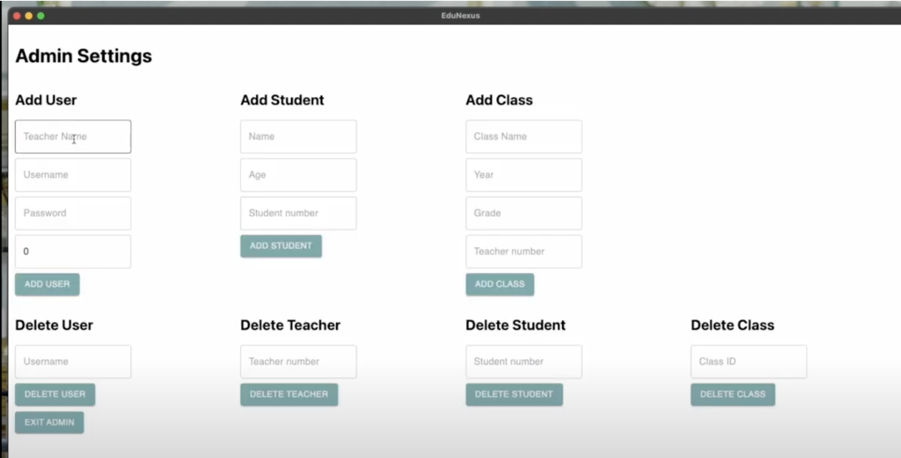
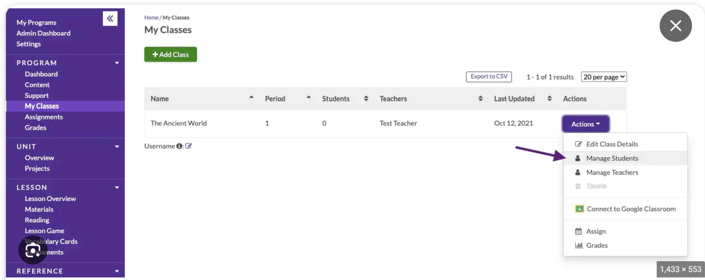

## D4 - Project Review

Please fill in the template below. Some suggestions have been provided to help you understand how to answer each segment.

Before submission, please replace the suggestions (in italics) with your answers. You can keep the prompts though.

### Project Name: _Enter project name_
### Team Name, Team Number: _Enter team name and number who the project belongs to_
### Github Link: _Enter the github link to the project_

### Project Summary:
_Provide a short summary of the project. Capture details like what problem it aims to solve and what are the key contributions of the project._
EduNexus is a desktop application designed to simplify educational administration for schools in underprivileged areas by automating student report generation and grade management. It tackles challenges like high student-to-teacher ratios and limited resources. The key contributions include automated report generation, in-depth performance analysis, secure data management, and intuitive visual analytics. It is designed for cross-platform compatibility, prioritizing user-friendliness and offline functionality to ensure accessibility and ease of use regardless of technological infrastructure. These features collectively aim to reduce the administrative burden on educators, facilitate tailored educational support, and ensure that EduNexus is a valuable tool for schools facing resource limitations.

### Introduction & Overview of the problem and the product:
In reviewing EduNexus, it was evident that the project adeptly addresses the significant challenges faced by schools in underprivileged regions, such as high student-to-teacher ratios and limited resources, by automating student report generation and grade management. The overview provided clear insights into EduNexus as an educational support application designed to streamline administrative tasks and enhance educational administration with features like automated report cards, performance analysis, and secure data management. Its differentiation from existing solutions is marked by its focus on offline functionality, ease of use, and optimization for low-resource settings, targeting specific needs that are not fully met by current educational management systems.

For suggestions, updating the README to reflect the current state of EduNexus will enhance the clarity of the project. Specifically, it's important to correct the section that mentions a bug where all teachers are assigned to the same classes—since this issue has been resolved, as indicated in the demo video. Instead, the README should highlight any existing bugs or limitations that are currently pertinent to the application's functionality, as discussed in the video. This adjustment will ensure that users and contributors have an accurate understanding of the project's status and can contribute more effectively to its development or utilize the application more efficiently. This approach not only improves transparency but also aligns the documentation with the project's progress, facilitating better engagement from the community and users.

### Demo of the application:
The EduNexus demo presents its ideas clearly and concisely, effectively outlining the application's purpose and its solutions for schools in underprivileged areas. The demonstration covers key features, such as automated report card generation, performance analysis, and visual analytics, showcasing how the application streamlines administrative tasks and enhances educational management. The walkthrough from login to specific functionalities, including editing grades and visualizing class statistics, provides a solid understanding of the application's capabilities and user interface.

While the demo effectively showcases the main features of EduNexus, including its critical role in streamlining educational administration for underprivileged areas, it missed an opportunity to demonstrate the delete functionality. This capability, visible in the UI but not discussed, allows users to remove students, teachers, and classes from the system. Including a walkthrough of this feature would not only have illustrated the application's user-friendly design and administrative flexibility but also provided insights into the organization and management of the underlying database.

Overall, the demo provided a clear and comprehensive understanding of EduNexus, illustrating its key functionalities and how it addresses the specific needs of educational institutions in underprivileged areas. The walkthrough of features such as automated report generation, performance analysis, and visual analytics effectively demonstrated the application's capability to streamline administrative tasks and enhance the educational experience. The explanation of the user interface and operational flow, from login to detailed feature utilization, offered a solid grasp of how the application operates in a real-world setting, reinforcing its value proposition and usability. The technical discussion is also very detailed and easy to understand. 

### Technical Discussion & Key Learnings:
The technical discussion within the EduNexus demo provided a clear and insightful understanding of the application's architecture and development process. The explanation of its foundation on Electron for cross-platform functionality, combined with the use of React for dynamic UI creation and SQLite for database management, illuminated the sophisticated yet practical approach to building the application. The team's reflection on key learnings, particularly the benefits of earlier adoption of pair programming and the consideration of alternative frameworks for improved performance, presents concrete and achievable strategies for enhancing project development. These insights, coupled with the mention of transitioning to more in-person coding sessions to bolster team dynamics, underscore a holistic approach to addressing both technical and collaborative aspects of the project. Additional information on the specific technical challenges faced, solutions implemented, and the rationale behind choosing Electron over other frameworks initially could have provided even deeper insights into the project's technical journey and decision-making process.

### Project Documentation:
The README for EduNexus serves as a comprehensive guide to understanding the project's purpose, key features, installation process, and underlying technologies, making it fairly easy to follow for a new user. It outlines the application's aim to support schools in underprivileged regions with automated report generation, data management, and visual analytics, among other functionalities. The step-by-step instructions for installation, along with the detailed list of technologies used (such as Electron, React, and SQLite), provide a solid foundation for users and developers alike to get started with the application. 

The two areas that causes confusion is the license information and the bug descriptions. The readme started with "TODO: License Info Here" which might causes the user to be confused. The word "Here" also didn't link with any links, making readers to be confused on if there is supposed to be a link attached. Moving this section towards the end of the README and clearly stating "License information coming soon" or "License details to be updated" would provide a clearer indication that this is a work in progress, thereby reducing confusion and setting appropriate expectations for the readers. Moreover, the discussion of a specific bug related to user management without clear updates on its resolution may leave readers uncertain about the current functionality and reliability of the application. It's essential for the documentation to reflect the latest state of the project accurately. 

### Project Deployment:
The instructions is very easy to follow, and I was able to install and start the application without any errors. The UI of the application representative is the same as the project when running locally. However, I wasn't able to run the tests using ``npm run wdio``. The error messages say that ``Electron app is not installed``. Including a section in your README about handling specific error messages, such as "Electron app is not installed," can greatly aid users in troubleshooting common issues they might encounter. This addition ensures that users are aware of the dependencies and prerequisites needed to successfully run your application and its associated commands. Since I wasn't able to see and run the tests, I could not comment on whether edge cases are considered for this application. 

Additional Suggestions: Including an estimated duration for the npm install command in the README documentation can indeed be a helpful addition, especially for new users who might not be familiar with the process. While it's true that installation times can vary widely depending on the user's internet connection and computer specifications, providing a rough estimate can set expectations and help users plan their setup process more effectively.
### Misc.:

Refining the UI to distribute functionalities contextually can significantly improve usability. Here is a image of your current UI for the admin access.

Placing add/delete actions for students directly within the classroom dashboard allows users to perform these tasks within the relevant context, making the process more intuitive. Similarly, teacher management could be streamlined within a dedicated teacher's section, where adding or removing educators is more logically situated. This approach will help with the user-friendlyness where actions are available in the areas they affect. Please see an eample below: 

